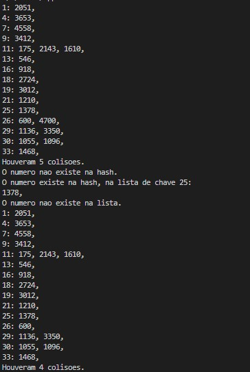

# Closed_Hash
O objetivo do problema é implementar uma Hash fechada que contenha as funções de insert, search e remove, assim como contando as colisões que ocorrerem.       
# Estrutura
A Hash é idealizada da seguinte maneira, existe uma lista dinâmica (de maneira similar a [dynamic_list](https://github.com/mpiress/dynamic_list)) que possui o próximo primo do tamanho do vetor inserido como tamanho próprio, e em cada posição da lista possuímos uma chave e uma lista de valores que correspondem a essa chave (type Hash).
# Logica

O programa possui alguns métodos importantes: *FLVazia()*, *InsereLista()*, *InsereHash()*, *printLista()*, *buscaHash()* e *removeHash()*.
1) FLVazia(List<T> *lista):      
Este método é responsável por inicializar qualquer tipo de Lista passada para ele (mais detalhes: [dynamic_list](https://github.com/mpiress/dynamic_list)).

2) InsereLista(List<T> *lista, T dado):      
Este método é responsável por inserir qualquer tipo de dado passado para ele numa lista também passada para o método (mais detalhes: [dynamic_list](https://github.com/mpiress/dynamic_list)).

3) InsereHash(List<Hash> *hash, List<int> *vetor):     
A partir de uma lista de Hash's vazia e de uma lista de inteiros preenchida, esse método inicializa a lista de Hash's setando o atributo de tamanho dela como o proximo primo do dobro do tamanho da lista de inteiros (*hash->qtd=proxPrimo((2\*vetor->qtd))*), depois insere um objeto tipo Hash contendo uma cahve sequencial (1,2,3,...) e uma lista de inteiros vazia, faz-se isto para todo o tamanho da Hash.      
Após iniciar a hash o método percorre a lista de inteiros passada calculando uma chave (*numero%hash->qtd*) para o valor atual e inserindo na lista de inteiros da posição da Hash que contém a mesma chave, caso já exista um valor nesta, há uma colisão, portanto adiciona-se 1 ao atributo *hahs->collisions* para que seja possível exibir a quantidade de colisões que houveram.

4) printLista(List<Hash> *hash):       
Percorre a Hash recebida printando os objetos(chave e lista de inteiros) aonde existe ao menos um item na lista de inteiros, e no final printar o número de colisões ocorridas.

5) buscaHash(List<Hash> *hash, int numero):       
Calcula uma chave (*numero%hash->qtd*) para o valor recebido e percorre a Hash recebida verificando se a chave do objeto atual é igual à chave calculada, caso seja, verifica se o número existe na lista de inteiros do objeto, caso exista, printa a chave e a lista de inteiros do objeto onde o número se encontra. Caso não encontre o número recebido, mostra ao usuário que ele não existe. 

6) removeHash(List<Hash> *hash, int numero):       
Realiza uma busca semelhante à *buscaHash()* e caso encontre remove o número da lista de inteiros do objeto aonde a chave bateu, assim como diminui o número de colisões em um já que este está sendo removido.

Obs.:      
- O programa não aceita entrada de usuários, ele utiliza um array estático de inteiros implementado, caso seja necessário deve-se criar um input para o array.

# Exemplo de execução
O main do programa está implementado para inserir o vetor na Hash, printar a Hash após iserção, buscar um número não existente, buscar um número que existe, remover um número que não existe, remover um número que existe e printar após remoção.      
Vetor:

> {1378, 3012, 600, 4700, 918, 175, 2051, 3653, 4558, 1210, 1468, 2724, 1055, 2143, 1136, 546, 3350, 1610, 3412, 1096}

Execução:

	 

       

# Conclusão

Ao compararmos a estrutura a uma semelhante porém aberta dupla, notamos que existem menos colisões na hora de inserção pois para inserirmos na fechada basta apenas colocar no final da lista, tendo assim um custo 1, porém na busca devemos percorrer a lista de inteiros de cada chave por completo para acharmos um valor específico. Ou seja, perde-se na busca porém ganha-se na inserção.

# Compilação e Execução

O programa possui um arquivo Makefile que realiza todo o procedimento de compilação e execução. Para tanto, temos as seguintes diretrizes de execução:

| Comando                |  Função                                                                                           |                     
| -----------------------| ------------------------------------------------------------------------------------------------- |
|  `make clean`          | Apaga a última compilação realizada contida na pasta build                                        |
|  `make`                | Executa a compilação do programa utilizando o gcc, e o resultado vai para a pasta build           |
|  `make run`            | Executa o programa da pasta build após a realização da compilação                                 |
